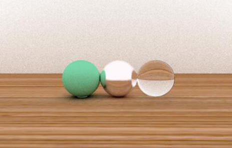

# SimpleRaytracer
A ray tracing renderer which can provide a multi-threaded rendering of objects on Lambert reflector, mental mirror, and glass, add textures, and make the object rotate.

### Demo




### Getting Start

```
git clone https://github.com/ZijingPeng/SimpleRaytracer
```

Then run `Program.cs`

### License

MIT License

